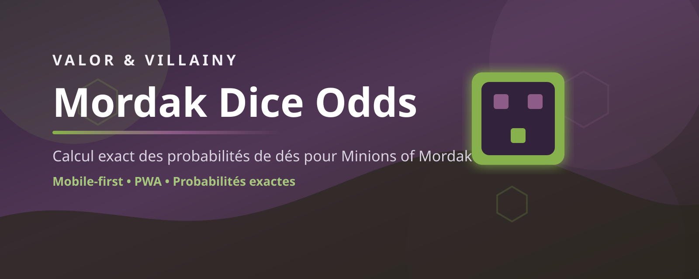

# Mordak Dice Odds



Calculateur exact de probabilités de dés pour *Valor & Villainy: Minions of Mordak*.

L'objectif de l'application est simple : aider un joueur à évaluer rapidement ses chances de réussite pendant une partie, directement depuis un téléphone ou un navigateur. L'app calcule les probabilités exactes d'un pool de dés, affiche la distribution complète des résultats possibles, et permet de sauvegarder ou rejouer des configurations fréquentes.

## Ce que fait l'app

- calcule la probabilité de faire `au moins`, `exactement` ou `au plus` un certain nombre de hits
- affiche l'espérance, la valeur minimale et la valeur maximale d'un pool
- montre la distribution complète des résultats sous forme lisible
- sauvegarde des presets en local
- conserve un historique des derniers setups
- partage une configuration via l'URL
- fonctionne comme base PWA pour un usage mobile

## Dés pris en charge

### Novice

- faces : `0, 0, 0, 1, 1, 1`

### Adept

- faces : `0, 1, 1, 1, 1, 2`

### Master

- faces : `1, 1, 1, 2, 2, 2`

## Principe de calcul

Le moteur utilise un calcul exact par convolution de distributions discrètes indépendantes. Ce choix évite l'imprécision d'une simulation Monte Carlo et garantit des résultats stables pour chaque configuration.

La logique métier principale se trouve dans :

- [src/domain/dice.ts](./src/domain/dice.ts)
- [src/domain/probability.ts](./src/domain/probability.ts)
- [src/domain/models.ts](./src/domain/models.ts)

## Stack technique

- React
- TypeScript
- Vite
- Vitest
- `vite-plugin-pwa`

## Lancer le projet

Installer les dépendances :

```powershell
npm.cmd install
```

Démarrer en développement :

```powershell
npm.cmd run dev
```

Build de production :

```powershell
npm.cmd run build
```

Lancer les tests :

```powershell
npm.cmd test
```

Sous PowerShell Windows, utiliser `npm.cmd` plutôt que `npm`.

## Utiliser l'app sur téléphone

Le plus simple est de lancer Vite sur le réseau local :

```powershell
npm.cmd run dev -- --host
```

Puis ouvrir depuis le téléphone l'URL locale exposée par Vite, par exemple :

```text
http://192.168.1.42:5173
```

Le téléphone et le PC doivent être sur le même réseau Wi-Fi.

## Déploiement sur Cloudflare Pages

Cette app est un très bon candidat pour Cloudflare Pages : c'est un frontend statique Vite, sans backend.

Configuration recommandée dans Cloudflare Pages :

- Framework preset : `React (Vite)`
- Build command : `npm run build`
- Build output directory : `dist`
- Root directory : laisser vide si ce repo ne devient pas un monorepo

Le fallback SPA est géré par la configuration détectée par Cloudflare lors du déploiement Vite/Wrangler. Il ne faut pas ajouter un fichier `_redirects` global vers `index.html` dans cette configuration, sinon Cloudflare détecte une boucle infinie.

### Étapes

1. Pousser le repo sur GitHub.
2. Dans Cloudflare, ouvrir `Workers & Pages`.
3. Choisir `Create application` puis `Pages`.
4. Importer le dépôt GitHub.
5. Vérifier les paramètres de build :
   `npm run build` et `dist`
6. Lancer le premier déploiement.

Une fois le site déployé, Cloudflare fournira une URL du type :

```text
https://mordak-dice-odds.pages.dev
```

Chaque `git push` sur la branche de production déclenchera un nouveau build.

### Sources

- Cloudflare Pages build config : https://developers.cloudflare.com/pages/configuration/build-configuration/
- Cloudflare Pages redirects : https://developers.cloudflare.com/pages/configuration/redirects/

## Structure actuelle

```text
src/
  app/
  domain/
  features/
    calculator/
  shared/
public/
docs/
```

## Vision

Cette version pose une base propre et maintenable pour aller plus loin :

- comparateur de scénarios
- objectifs de jeu dérivés du rulebook
- presets tactiques plus riches
- expérience mobile encore plus optimisée
